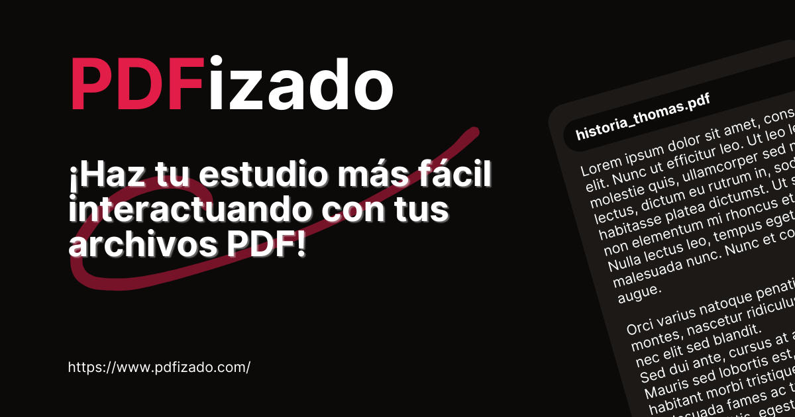

<h1 style="text-align: center; font-size: 3.2rem; font-weight: 900;">
 PDFizado
</h1>

Habla con una Inteligencia Artificial para extraer la información de tus PDFs y facilitar tu lectura.

## Una aplicación para facilitar tu estudio

Con [**PDFizado**](https://www.pdfizado.com) podrás interactuar mediante un chat con una IA para extraer la información que sea de tu interés y hacer mucho más fácil tu estudio simplemente preguntando lo que requieras en específico y recibirás una respuesta concisa con justo lo que preguntaste.

### Planes

Existen 3 planes disponibles para poder utilizar [**PDFizado**](https://www.pdfizado.com/pricing):

1. Gratis
2. $25.000,00\*
3. $50.000,00\*

_\*: Precio en Pesos Colombianos y facturado de forma mensual. Pronto se agregarán más divisas y pasarelas de pago para usuarios fuera de Colombia._

Utilizamos Lemon Squeezy y Paddle para el procesamiento de la suscripción mensual o anual que adquieras.

# Creado por Andrés Rodríguez en Colombia
